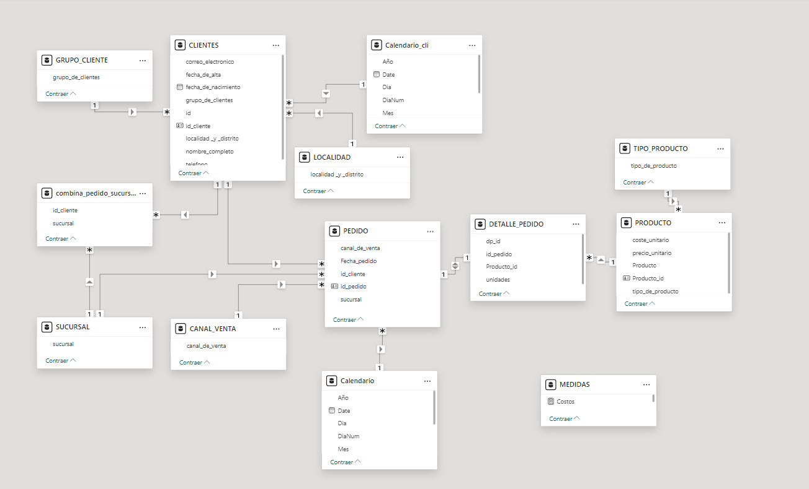

Proyecto realizado con Power BI,
los datos son de una fuente de archivos excel 
-Aplicación de modelado y diagrama dimensional copo de nieve 
-Se realizó la limpieza de datos del archivo excel con ayuda de Power Query 
-Se realizó el correcto tipado de los datos.  
-Se implementó buenas prácticas para la creación de las funciones DAX. 
-Se implementó buenas prácticas para el manejo de los datos tipo DATE  

imagen del modelado tipo copo de nieve
 
Para visualizar los gráficos dirigirse a la carpeta vista